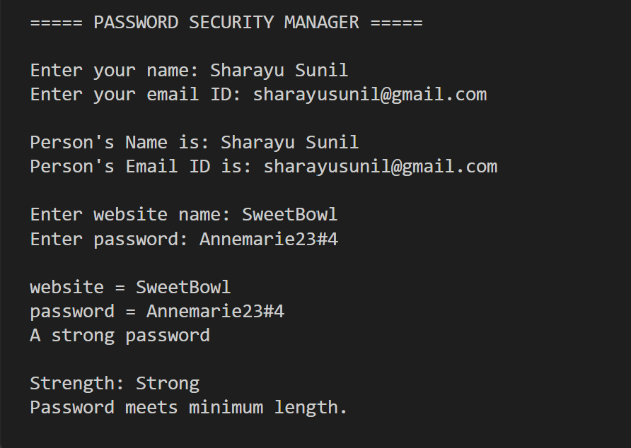

**PASSWORD SECURITY MANAGER**

## PROJECT OVERVIEW
It is a Java based application for managing information about password. It will take the user's information like name, email ID and also takes passwords from websites. It then checks the password strength, checks a minimum password length and saves all the information ith as taken into a text file.

This project illustrates the concepts of Java Object Oriented Programming including concepts like classes, constructors, objects, inheritance, encapsulation. abstraction, interfaces, method overwriting and overloading, exception handling and file handling.

## FEATURES
1.Uses name, email ID, website name and password.(input).

2.Displays user and password information.

3.Checks and notices the password type.

4.Sees if the password strength is Strong, Medium, or Weak.

65.Checks the length of the password.

6.Saves website and password information into a text file.

7.Manages the file-writing errors with the help ofexception handling. 

## FUNCTIONAL MODULES
1. User Information Management

It takes and displays the user's name and email ID.

Here, UserInfo.java 

2. Password Management

Takes website and password information and displays the password details and the type of password.

Here, InfosPassword.java

3. Checking Password Strength 

Checks password strength on the basis of length and sees if it meets the required minimum lergth.

Here, StrengthManager.java

4. Storing password in a text file.

Saves website and password information into a text file.

Here, FileSaving.java

##TECHNOLOGIES THAT HAVE BEEN USED

1.VS CODE
2.JDL
3.JAVA PROGRAMMING LANGUAGE
4.Scanner FOR USER INPUT
5.GIT
6.GIT HUB
    
## PROJECT STRUCTURE

Password-Security-Manager/

├── MainStart.java  
├── UserInfo.java  
├── InfosPassword.java  
├── StrengthManager.java  
├── FileSaving.java  
├── .gitignore

## CONCEPTS OF JAVA THAT ARE ILLUSTRATED ARE AS FOLLOWS
I have used :
1.Constructors
2.Classes and Objects are defined
3.this keyword and super keyword
4.accecss modifiers like protect and private
5.Abstraction, Inheritance, Encapsulation
6.Interfaces
7.Method Overriding and Method Overloading
8.condtional statements
9.String concepts and operations
10.try - catch from exception handling
11.Scanner for taking user input
12.File Writer

## SETUP AND INSTALLATION

1. Check Java Installation

In the terminal of VS Code, make sure that Java is installed by running the command:

java --version

In addition, run another command:

javac --version

2. Open the Project

Open the Password-Security-Manager folder

on the Visual Studio Code platform.

Open the terminal on the folder.

3. Compile the Project

run the javac command:

javac MainStart.java UserInfo.java InfosPassword.java StrengthManager.java FileSaving.java

4. Run the Project

The final step is to run the command:

java MainStart

HOW TO USE?
The user is required to enter-
Name:
Email ID:
Website name:

## INSTRUCTIONS FOR TESTING
In order to test the Password Security Manager it will be needed to compile all Java files and launch the MainStart class. In the process, the user will be asked to enter the name, email ID, website name, and password. It will be possible to make sure that the application correctly displays the entered user and password details, detects the password type, and estimates whether the password is Strong, Medium, Weak, or meets the minimum password-length requirement. It will also be possible to check if the website and password details are successfully saved to the text file and if the application displays an appropriate error message in case of failure to write to the file.

## screenshot

## NON FUNCTIONAL REQUIREMENTS
Performance

The application utilizes straightforward string and file operations, enabling the fast processing of the password.

Usability

The application guides the user through the process of providing the user data, the website’s data, and the password.

Reliability

The application implements the exception handling mechanism while performing operations with the file, thus avoiding common file-writing errors.

Maintainability

The application is split into several Java classes according to their responsibility, which increases the maintainability of the code.

Error handling

The FileSaving.java class employs the try-catch mechanism to handle IO exceptions.

Resource Efficiency

The application uses simple Java operations and closes the Scanner and FileWriter objects after utilizing them.

Limitations

The application is a demo version meant to showcase the Java and OOP concepts and should not be used for critical data. The password is displayed on the screen and saved as a simple text file, therefore, it is not suitable for production environments.

##FUTURE ENHANCEMENTS
The application can have features in future like masking of password while entering,secure storage of password with encryption of the password,multiple web site-password entries,
retrieving previously entered passwords,generating the passwords.

The user-interface of the application should be developed using graphics.Better check for the strength of the password may be made which may include checking for presence of uppercase letters, lowercase letters, numbers, and special characters.

##AUTHOR
Sharayu
